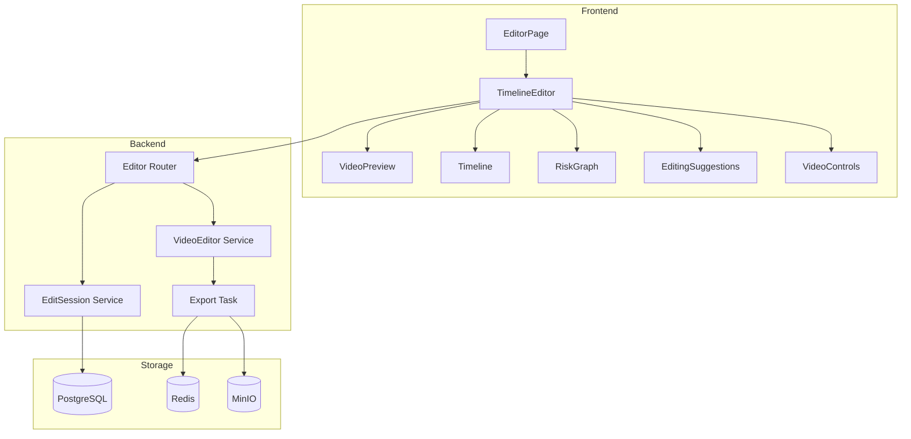
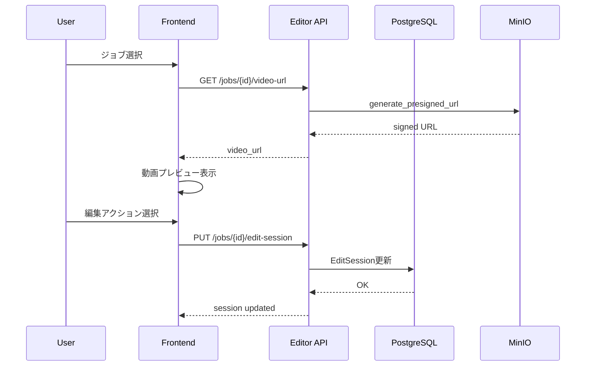
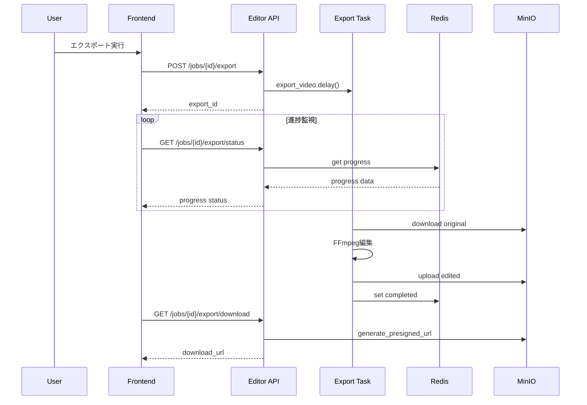
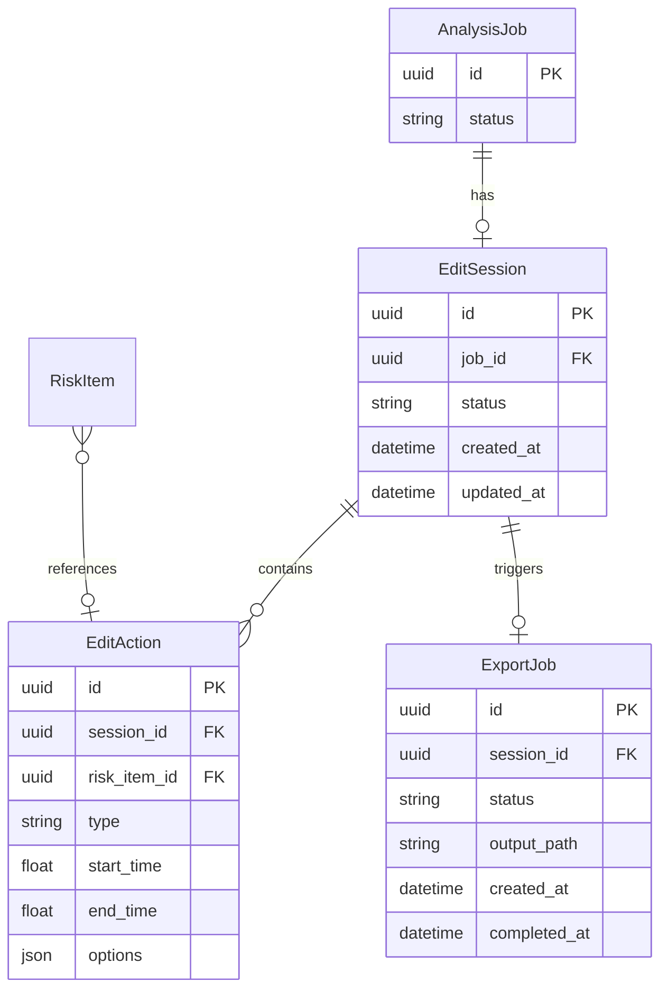

# Design Document: Timeline Editor

## Overview

**Purpose**: リスク判定完了後の動画に対して、検出された全リスク区間（高・中・低）を視覚的に確認し、AI編集提案に基づいて編集（カット/ミュート/モザイク/テロップ）を適用、編集済み動画をエクスポートする機能を提供する。

**Users**: SaaSベンダーの広報担当者が、SNS投稿前の動画から炎上リスク箇所を編集・除去するワークフローで使用する。

**Impact**: 既存のVideo Risk Analyzerに編集機能を追加。フロントエンドに新規editorモジュール、バックエンドに編集API・FFmpeg処理サービス・エクスポートタスクを追加する。

### Goals
- リスク判定結果をタイムラインUIで可視化
- AI編集提案に基づくインタラクティブな編集操作
- FFmpegによる動画編集・エクスポート
- 編集セッションの永続化と中断・再開

### Non-Goals
- リアルタイム動画編集プレビュー（編集適用前のプレビューは提供しない）
- 音声波形の詳細表示（将来検討）
- 複数動画の一括編集
- モバイルでのモザイク領域指定（デスクトップのみ）

## Architecture

### Existing Architecture Analysis
- **フロントエンド**: React + TypeScript + Vite、コンポーネント単位の構成
- **バックエンド**: FastAPI + SQLAlchemy + Celery + Redis
- **ストレージ**: MinIO（S3互換）、presigned URL生成済み
- **既存パターン**: ジョブベースの非同期処理、Redis進捗管理、SSE配信

### Architecture Pattern & Boundary Map



**Architecture Integration**:
- **Selected pattern**: レイヤードアーキテクチャ（既存パターン踏襲）
- **Domain boundaries**: Editor機能を独立モジュールとして分離（`frontend/src/components/editor/`, `backend/app/api/routes/editor.py`）
- **Existing patterns preserved**: Celeryタスク、Redis進捗管理、presigned URL
- **New components rationale**: 編集機能は結果表示と責務が異なるため独立

### Technology Stack

| Layer | Choice / Version | Role in Feature | Notes |
|-------|------------------|-----------------|-------|
| Frontend | React 18.2 + TypeScript 5.3 | タイムラインエディタUI | 既存スタック継続 |
| Backend | FastAPI 0.109 | 編集API | 既存スタック継続 |
| Task Queue | Celery 5.3 + Redis | エクスポート処理 | 既存パターン流用 |
| Video Processing | FFmpeg 6.x | 動画編集 | 新規追加（Dockerに含む） |
| Storage | MinIO | 動画・編集済みファイル | 既存利用 |

## System Flows

### 編集フロー



### エクスポートフロー



## Requirements Traceability

| Requirement | Summary | Components | Interfaces | Flows |
|-------------|---------|------------|------------|-------|
| 1.1-1.5 | 動画プレビュー | VideoPreview | GET /video-url | 編集フロー |
| 2.1-2.6 | 再生コントロール | VideoControls | - | - |
| 3.1-3.7 | リスクスコアグラフ | RiskGraph | - | - |
| 4.1-4.7 | タイムライン | Timeline | - | - |
| 5.1-5.10 | 編集提案パネル | EditingSuggestions | - | - |
| 6.1-6.6 | 編集アクション拡張 | EditingSuggestions, EditSessionService | PUT /edit-session | 編集フロー |
| 7.1-7.5 | ヘッダーアクション | TimelineEditor | PUT /edit-session, POST /export | 編集・エクスポートフロー |
| 8.1-8.6 | 動画編集処理 | VideoEditorService, ExportTask | POST /export, GET /export/status | エクスポートフロー |
| 9.1-9.5 | レスポンシブ対応 | 全UIコンポーネント | - | - |

## Components and Interfaces

### Component Summary

| Component | Domain/Layer | Intent | Req Coverage | Key Dependencies | Contracts |
|-----------|--------------|--------|--------------|------------------|-----------|
| TimelineEditor | UI/Container | エディタ全体のレイアウト管理 | 1-9 | VideoPreview, Timeline, etc. (P0) | State |
| VideoPreview | UI/Presentation | 動画プレビュー表示 | 1.1-1.5 | video element (P0) | - |
| VideoControls | UI/Presentation | 再生コントロール | 2.1-2.6 | VideoPreview (P0) | - |
| RiskGraph | UI/Presentation | リスクスコアグラフ表示 | 3.1-3.7 | RiskItem[] (P0) | - |
| Timeline | UI/Presentation | タイムライン表示・操作 | 4.1-4.7 | EditAction[] (P0) | - |
| EditingSuggestions | UI/Presentation | 編集提案パネル | 5.1-5.10, 6.1-6.6 | RiskItem[], EditAction[] (P0) | - |
| useEditSession | Hook | 編集セッション状態管理 | 6.1-6.6, 7.2-7.3 | Editor API (P0) | State |
| EditorRouter | Backend/API | 編集API | 1.1, 6-8 | EditSessionService, VideoEditorService (P0) | API |
| EditSessionService | Backend/Service | セッションCRUD | 6, 7 | PostgreSQL (P0) | Service |
| VideoEditorService | Backend/Service | FFmpegコマンド生成・実行 | 8.1-8.6 | FFmpeg (P0) | Service |
| ExportTask | Backend/Task | エクスポート非同期処理 | 8.1-8.6 | VideoEditorService (P0), MinIO (P0) | Batch |

### Frontend Layer

#### TimelineEditor

| Field | Detail |
|-------|--------|
| Intent | エディタ画面全体のレイアウトと状態管理 |
| Requirements | 1.1, 7.1-7.5, 9.1-9.5 |

**Responsibilities & Constraints**
- 子コンポーネントへの状態配布
- 編集セッションの保存・復元トリガー
- レスポンシブレイアウト切り替え

**Dependencies**
- Outbound: useEditSession — セッション管理 (P0)
- Outbound: Editor API — データ取得・更新 (P0)

**Contracts**: State [x]

##### State Management
```typescript
interface TimelineEditorState {
  jobId: string
  videoUrl: string | null
  currentTime: number
  duration: number
  isPlaying: boolean
  selectedRiskItemId: string | null
  editSession: EditSession | null
  exportStatus: ExportStatus | null
}
```

#### useEditSession

| Field | Detail |
|-------|--------|
| Intent | 編集セッションのCRUD操作とUndo管理 |
| Requirements | 6.1-6.6, 7.2-7.3 |

**Responsibilities & Constraints**
- 編集アクションの追加・削除・更新
- Undo履歴の管理（最大20件）
- APIとの同期

**Dependencies**
- Outbound: Editor API — セッション永続化 (P0)

**Contracts**: State [x]

##### State Management
```typescript
interface UseEditSessionReturn {
  session: EditSession | null
  isLoading: boolean
  error: Error | null
  addAction: (action: Omit<EditAction, 'id'>) => void
  updateAction: (id: string, updates: Partial<EditAction>) => void
  removeAction: (id: string) => void
  undo: () => void
  canUndo: boolean
  save: () => Promise<void>
}
```

### Backend Layer

#### EditorRouter

| Field | Detail |
|-------|--------|
| Intent | 編集機能のRESTful APIエンドポイント |
| Requirements | 1.1, 6-8 |

**Responsibilities & Constraints**
- リクエストバリデーション
- サービス層への委譲
- レスポンス整形

**Dependencies**
- Inbound: Frontend — HTTP (P0)
- Outbound: EditSessionService — セッション操作 (P0)
- Outbound: VideoEditorService — エクスポート (P0)

**Contracts**: API [x]

##### API Contract

| Method | Endpoint | Request | Response | Errors |
|--------|----------|---------|----------|--------|
| GET | /api/jobs/{job_id}/video-url | - | VideoUrlResponse | 404 |
| GET | /api/jobs/{job_id}/edit-session | - | EditSessionResponse | 404 |
| PUT | /api/jobs/{job_id}/edit-session | EditSessionUpdate | EditSessionResponse | 400, 404 |
| POST | /api/jobs/{job_id}/export | - | ExportResponse | 400, 404 |
| GET | /api/jobs/{job_id}/export/status | - | ExportStatusResponse | 404 |
| GET | /api/jobs/{job_id}/export/download | - | DownloadUrlResponse | 404 |

#### VideoEditorService

| Field | Detail |
|-------|--------|
| Intent | FFmpegコマンド生成・実行 |
| Requirements | 8.1-8.6 |

**Responsibilities & Constraints**
- EditActionからFFmpegフィルター式を生成
- 複数アクションを1つのフィルターチェーンに統合
- 進捗のパース・報告

**Dependencies**
- External: FFmpeg — 動画編集 (P0)
- Outbound: MinIO — ファイル取得・保存 (P0)

**Contracts**: Service [x]

##### Service Interface
```python
class VideoEditorService:
    def generate_filter_complex(
        self,
        actions: list[EditAction]
    ) -> tuple[str, str]:
        """
        編集アクションからFFmpegフィルター式を生成
        Returns: (video_filter, audio_filter)
        """
        ...

    async def execute_edit(
        self,
        input_path: str,
        output_path: str,
        actions: list[EditAction],
        progress_callback: Callable[[float], None]
    ) -> None:
        """
        FFmpegを実行して動画を編集
        Raises: VideoEditError
        """
        ...
```

**Implementation Notes**
- フィルター順序: カット → ミュート → モザイク → テロップ
- `-progress pipe:1`で進捗取得、`frame=`行をパース
- 日本語テロップは`fontfile=/usr/share/fonts/noto/NotoSansJP-Regular.ttf`指定

#### ExportTask

| Field | Detail |
|-------|--------|
| Intent | エクスポートのCelery非同期タスク |
| Requirements | 8.1-8.6 |

**Responsibilities & Constraints**
- MinIOから元動画ダウンロード
- VideoEditorService呼び出し
- 編集済み動画アップロード
- 進捗・完了状態のRedis更新

**Dependencies**
- Inbound: Celery — タスクキュー (P0)
- Outbound: VideoEditorService — 編集実行 (P0)
- Outbound: MinIO — ファイル操作 (P0)
- Outbound: Redis — 進捗管理 (P0)

**Contracts**: Batch [x]

##### Batch / Job Contract
- **Trigger**: `POST /api/jobs/{job_id}/export` からCelery経由
- **Input**: job_id, edit_session
- **Output**: 編集済み動画をMinIOに保存、Redis進捗更新
- **Idempotency**: 同一job_idの再実行時は既存エクスポートを上書き

## Data Models

### Domain Model



### Logical Data Model

**EditSession**
- 1つのAnalysisJobに対して0..1のEditSessionが存在
- status: `draft` | `exporting` | `completed`
- 自動保存は行わず、ユーザーの保存操作でのみ永続化

**EditAction**
- 1つのEditSessionに複数のEditActionが存在
- type: `cut` | `mute` | `mosaic` | `telop` | `skip`
- options: type依存のJSON（MosaicOptions, TelopOptionsなど）
- risk_item_idはオプション（手動追加の場合はnull）

**ExportJob**
- 1つのEditSessionに対して0..nのExportJobが存在（再エクスポート可能）
- output_path: MinIO上の編集済み動画パス

### Physical Data Model

```sql
-- EditSession
CREATE TABLE edit_sessions (
    id UUID PRIMARY KEY DEFAULT gen_random_uuid(),
    job_id UUID NOT NULL REFERENCES analysis_jobs(id),
    status VARCHAR(20) NOT NULL DEFAULT 'draft',
    created_at TIMESTAMP NOT NULL DEFAULT NOW(),
    updated_at TIMESTAMP NOT NULL DEFAULT NOW(),
    UNIQUE(job_id)
);

-- EditAction
CREATE TABLE edit_actions (
    id UUID PRIMARY KEY DEFAULT gen_random_uuid(),
    session_id UUID NOT NULL REFERENCES edit_sessions(id) ON DELETE CASCADE,
    risk_item_id UUID REFERENCES risk_items(id),
    type VARCHAR(20) NOT NULL,
    start_time FLOAT NOT NULL,
    end_time FLOAT NOT NULL,
    options JSONB,
    created_at TIMESTAMP NOT NULL DEFAULT NOW()
);

CREATE INDEX idx_edit_actions_session ON edit_actions(session_id);

-- ExportJob
CREATE TABLE export_jobs (
    id UUID PRIMARY KEY DEFAULT gen_random_uuid(),
    session_id UUID NOT NULL REFERENCES edit_sessions(id),
    status VARCHAR(20) NOT NULL DEFAULT 'pending',
    output_path VARCHAR(500),
    error_message TEXT,
    created_at TIMESTAMP NOT NULL DEFAULT NOW(),
    completed_at TIMESTAMP
);

CREATE INDEX idx_export_jobs_session ON export_jobs(session_id);
```

### Data Contracts & Integration

**API Data Transfer**

```typescript
// Request
interface EditSessionUpdate {
  actions: EditActionInput[]
}

interface EditActionInput {
  id?: string
  riskItemId?: string
  type: 'cut' | 'mute' | 'mosaic' | 'telop' | 'skip'
  startTime: number
  endTime: number
  options?: MosaicOptions | TelopOptions
}

interface MosaicOptions {
  x: number
  y: number
  width: number
  height: number
  blurStrength?: number
}

interface TelopOptions {
  text: string
  x: number
  y: number
  fontSize: number
  fontColor: string
  backgroundColor?: string
}

// Response
interface EditSessionResponse {
  id: string
  jobId: string
  status: 'draft' | 'exporting' | 'completed'
  actions: EditActionResponse[]
  createdAt: string
  updatedAt: string
}

interface ExportStatusResponse {
  exportId: string
  status: 'pending' | 'processing' | 'completed' | 'failed'
  progress: number
  errorMessage?: string
}

interface DownloadUrlResponse {
  url: string
  expiresAt: string
}
```

## Error Handling

### Error Strategy
- ユーザーエラー: 入力バリデーション、適切なエラーメッセージ
- システムエラー: FFmpeg失敗時はリトライ可能、ログ記録
- 回復: エクスポート失敗時は再実行オプション提供

### Error Categories and Responses

| Category | Scenario | Response | User Action |
|----------|----------|----------|-------------|
| 400 | 無効な編集アクション | ValidationError | 入力修正 |
| 404 | ジョブ/セッション不存在 | NotFoundError | ジョブ一覧へ戻る |
| 409 | エクスポート中に再実行 | ConflictError | 完了待ち |
| 500 | FFmpeg実行失敗 | InternalError + retry | 再試行ボタン |

### Monitoring
- エクスポート失敗率の監視
- FFmpeg実行時間の計測
- Celeryタスクキュー長の監視

## Testing Strategy

### Unit Tests
- `VideoEditorService.generate_filter_complex`: 各アクションタイプのフィルター生成
- `useEditSession`: アクション追加・削除・Undo
- `EditSessionService`: CRUD操作

### Integration Tests
- API → Service → DB の一連のフロー
- エクスポートタスクの完了確認
- 進捗更新のRedis連携

### E2E Tests
- 編集アクション追加 → 保存 → 再読み込み
- エクスポート実行 → 進捗表示 → ダウンロード

### Performance Tests
- 10分動画のエクスポート時間計測
- 複数編集アクション（10件）の同時適用

## Security Considerations

- presigned URLの有効期限: 1時間（デフォルト）
- 編集セッションはジョブ所有者のみアクセス可能（将来の認証実装時）
- FFmpegコマンドインジェクション防止: 入力値のサニタイズ

## Performance & Scalability

- エクスポート処理はCeleryワーカーで並列実行
- 大容量動画（1GB超）はチャンク処理検討（現時点ではスコープ外）
- 編集セッションのAPIレスポンスは100ms以内を目標
