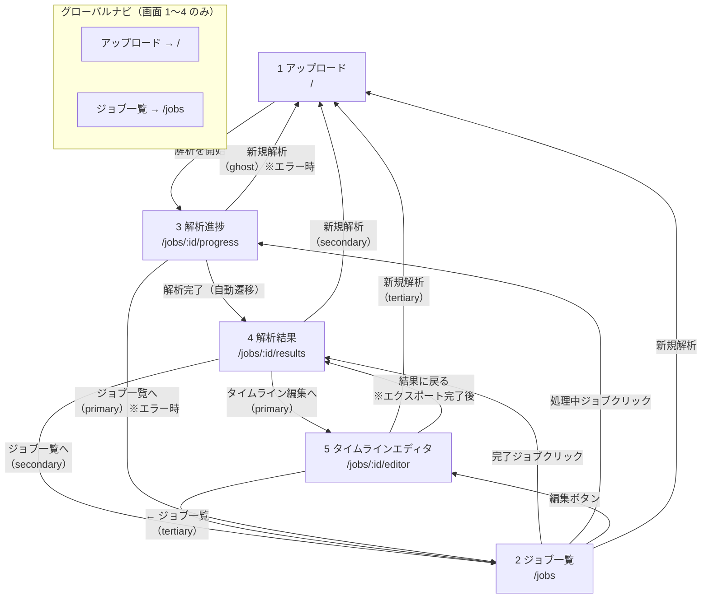

# 画面一覧・画面遷移

## 画面一覧

| # | 画面名 | URL | コンポーネント | 概要 |
|---|--------|-----|---------------|------|
| 1 | アップロード | `/` | `UploadComponent` | 動画ファイルのアップロードとメタデータ入力 |
| 2 | ジョブ一覧 | `/jobs` | `JobListComponent` | 解析ジョブの一覧表示・ステータス確認 |
| 3 | 解析進捗 | `/jobs/:id/progress` | `ProgressComponent` | 解析処理のリアルタイム進捗表示 |
| 4 | 解析結果 | `/jobs/:id/results` | `ResultsComponent` | リスク判定結果の詳細表示 |
| 5 | タイムラインエディタ | `/jobs/:id/editor` | `EditorPage` | 動画編集・エクスポート（フルスクリーン） |

## レイアウト

- 画面 1〜4: グローバルナビ（アップロード / ジョブ一覧）付きの共通レイアウト
- 画面 5: グローバルナビなし。エディタ専用のフルスクリーンレイアウト

## 画面遷移図

## ボタンデザイン体系

### 共通（ライトテーマ: 画面 1〜4）

| レベル | スタイル | 用途 |
|--------|---------|------|
| Primary | 青塗り `#2563eb`・ピル型 | その画面の最優先アクション |
| Secondary | 青アウトライン `#2563eb`・ピル型 | 補助的な導線 |

### エディタ（ダークテーマ: 画面 5）

| レベル | スタイル | 用途 |
|--------|---------|------|
| Primary | 青塗り `#2563eb`・ピル型 | エクスポート・ダウンロード |
| Ghost | 枠線 + 透明背景・ピル型 | 編集アクション（提案・保存・Undo） |
| Tertiary | ソリッド背景 `#334155`・枠なし・ピル型 | ナビゲーション（← ジョブ一覧・新規解析） |

## 各画面の詳細

### 1. アップロード (`/`)
- 動画ファイルのドラッグ&ドロップまたは選択
- メタデータ入力（用途、プラットフォーム、想定ターゲット）
- 「解析を開始」ボタン（primary）→ 解析進捗画面へ自動遷移

### 2. ジョブ一覧 (`/jobs`)
- 全ジョブをステータスバッジ付きで一覧表示
- 完了ジョブ: クリックで解析結果へ / 「編集」ボタン（ghost）でエディタへ
- 処理中・待機中ジョブ: クリックで進捗画面へ
- 「新規解析」ボタン（primary）→ アップロード画面へ

### 3. 解析進捗 (`/jobs/:id/progress`)
- フェーズ別リアルタイム進捗バー表示（音声解析・映像解析・リスク評価）
- 解析完了後 → 解析結果画面へ自動遷移
- エラー時: 「ジョブ一覧へ」（primary）+「新規解析」（ghost）

### 4. 解析結果 (`/jobs/:id/results`)
- リスク判定結果の詳細（スコア、リスク箇所一覧）
- ボタン配置（左→右）: 「ジョブ一覧へ」（secondary）→「新規解析」（secondary）→「タイムライン編集へ」（primary）

### 5. タイムラインエディタ (`/jobs/:id/editor`)
- フルスクリーン・ダークテーマ（グローバルナビなし）
- ヘッダー左: 「← ジョブ一覧」（tertiary）+ タイトル・動画名
- ヘッダー右: 「新規解析」（tertiary）│ 提案・保存・Undo（ghost）・エクスポート（primary）
- 動画プレビュー + 再生コントロール
- リスクスコアグラフ（SVG）
- タイムライン（カット範囲・AI提案範囲表示）
- 編集提案パネル（サイドバー / モバイルアコーディオン）
- エクスポート完了後: 「ダウンロード」（primary）+「結果に戻る」（ghost）

## API エンドポイント対応

| 画面 | 使用API |
|------|---------|
| アップロード | `POST /api/videos` |
| ジョブ一覧 | `GET /api/jobs` |
| 解析進捗 | `GET /api/jobs/:id/progress` |
| 解析結果 | `GET /api/jobs/:id/results` |
| エディタ | `GET /api/jobs/:id/results` |
| エディタ | `GET /api/jobs/:id/video-url` |
| エディタ | `GET /api/jobs/:id/edit-session` |
| エディタ | `PUT /api/jobs/:id/edit-session` |
| エディタ | `POST /api/jobs/:id/export` |
| エディタ | `GET /api/jobs/:id/export/status` |
| エディタ | `GET /api/jobs/:id/export/file` |
| エディタ | `GET /api/jobs/:id/export/download` |
