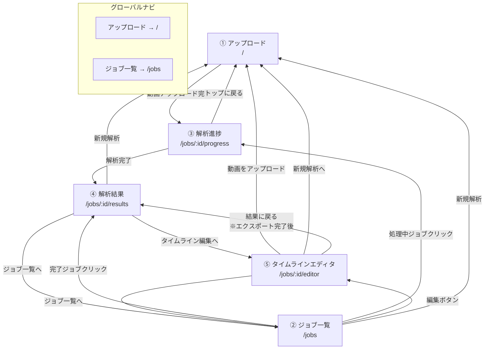

# 画面一覧・画面遷移

## 画面一覧

| # | 画面名 | URL | コンポーネント | 概要 |
|---|--------|-----|---------------|------|
| 1 | アップロード | `/` | `UploadComponent` | 動画ファイルのアップロードとメタデータ入力 |
| 2 | ジョブ一覧 | `/jobs` | `JobListComponent` | 解析ジョブの一覧表示・ステータス確認 |
| 3 | 解析進捗 | `/jobs/:id/progress` | `ProgressComponent` | 解析処理のリアルタイム進捗表示 |
| 4 | 解析結果 | `/jobs/:id/results` | `ResultsComponent` | リスク判定結果の詳細表示 |
| 5 | タイムラインエディタ | `/jobs/:id/editor` | `EditorPage` | 動画編集・エクスポート |

## 画面遷移図

## 各画面の詳細

### ① アップロード (`/`)
- 動画ファイルのドラッグ&ドロップまたは選択
- メタデータ入力（目的、プラットフォーム、対象者）
- アップロード完了後 → 解析進捗画面へ自動遷移

### ② ジョブ一覧 (`/jobs`)
- 全ジョブをステータスバッジ付きで一覧表示
- 完了ジョブ: クリックで解析結果へ / 「編集」ボタンでエディタへ
- 処理中・待機中ジョブ: クリックで進捗画面へ
- 「新規解析」ボタン → アップロード画面へ

### ③ 解析進捗 (`/jobs/:id/progress`)
- リアルタイム進捗バー表示
- 解析完了後 → 解析結果画面へ自動遷移
- 「トップに戻る」ボタン → アップロード画面へ

### ④ 解析結果 (`/jobs/:id/results`)
- リスク判定結果の詳細（スコア、リスク箇所一覧）
- 「タイムライン編集へ」ボタン → エディタ画面へ
- 「ジョブ一覧へ」ボタン → ジョブ一覧へ
- 「新規解析」ボタン → アップロード画面へ

### ⑤ タイムラインエディタ (`/jobs/:id/editor`)
- 動画プレビュー + 再生コントロール
- リスクスコアグラフ（SVG）
- タイムライン（カット範囲・AI提案範囲表示）
- 編集提案パネル（サイドバー / モバイルアコーディオン）
- ヘッダーアクション: アップロード、保存、Undo、エクスポート
- エクスポート完了後「結果に戻る」ボタン → 解析結果画面へ

## API エンドポイント対応

| 画面 | 使用API |
|------|---------|
| アップロード | `POST /api/jobs` |
| ジョブ一覧 | `GET /api/jobs` |
| 解析進捗 | `GET /api/jobs/:id/progress` (SSE) |
| 解析結果 | `GET /api/jobs/:id/results` |
| エディタ | `GET /api/jobs/:id/video-url` |
| エディタ | `GET /api/jobs/:id/edit-session` |
| エディタ | `PUT /api/jobs/:id/edit-session` |
| エディタ | `POST /api/jobs/:id/export` |
| エディタ | `GET /api/jobs/:id/export/status` |
| エディタ | `GET /api/jobs/:id/export/download` |
